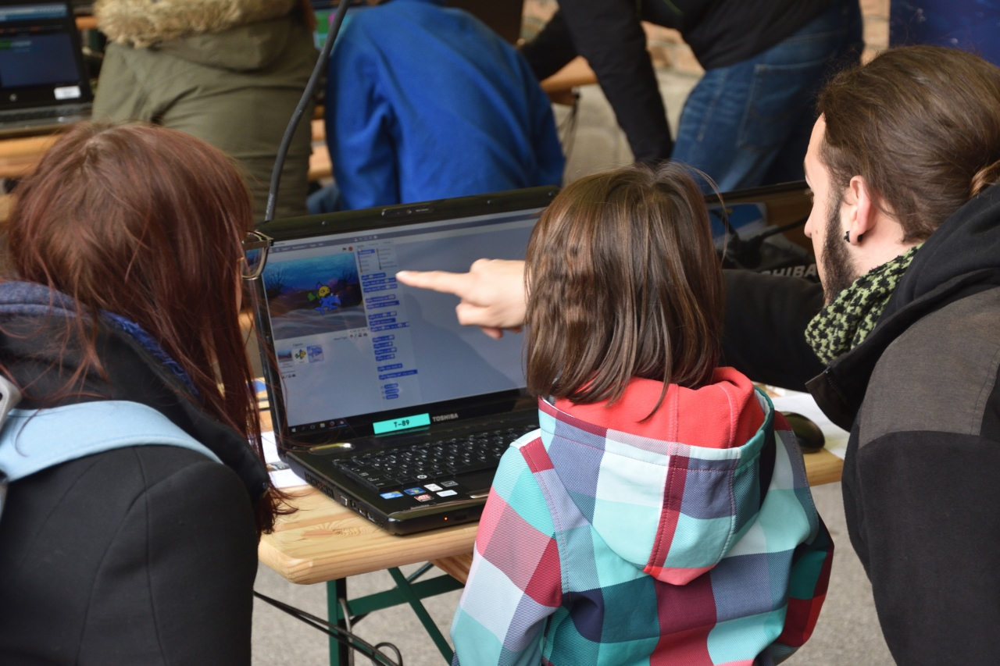

## CodeWeek 2019 in Österreich

Heuer findet die CodeWeek von **5.-20. Oktober 2019** statt:

- [CodeWeek ParkTour in Wien](parktour_2018.md)
- [Alle CodeWeek Events in Österreich anzeigen](https://codeweek.eu/search/?q=&country_iso=AT&past=no)
- [Neuen CodeWeek Event eintragen](http://events.codeweek.eu/add/)

## Einstiegshilfen

* [Scratch](https://scratch.mit.edu/): Die offizielle Website mit vielen Beispielen, Projekten und Informationen rund um Scratch
* [CoderDojo Wien Übungen](https://wien.coderdojo.net/exercises/): Von C# über micro:bit bis zu Scratch
* [Catrobat](https://www.catrobat.org/de/): Eine Android App zum einfachen Erstellen Animationen, Musikvideos und Spielen
* [Hour of Code Games by Kahoot!](https://kahoot.com/explore/collections/hour-code-games-kahoot/): 3 Quizzes zu Programmiergrundlagen (auf Englisch)

# Über die CodeWeek
Die [Europe Code Week](http://www.codeweek.eu/) ist eine europaweite Initiative, gestartet von den Young Advisors und den Digital Champions der früheren EU-Kommissarin Neelie Kroes im Jahr 2013. Die CodeWeek findet seither jährlich im Oktober statt.

## Die Ziele
*   **Förderung** von Jugendlichen, Kindern und Frauen, damit diese die immer wichtiger werdende Kulturtechnik des Programmierens erlernen.
*   **Bewusstsein** schaffen auf allen europäischen und nationalen Ebenen
*   **Zusammenarbeit** zwischen bereits existierenden Initiativen und Gruppen in dem Bereich fördern
*   **Teilen** von Beispielen aus der Praxis
*   **Organisation** von Veranstaltungen und Workshops in allen EU-Mitgliedsländern zum Thema Programmieren

## Die Europe CodeWeek in Zahlen

- 2018: 2.700.00 Teilnehmer_innen
- 2017: 52 Länder, 25.000 Veranstaltungen, 1.099.000 Teilnehmer_innen
- 2016: 50 Länder, 23.000 Veranstaltungen, 968.000 Teilnehmer_innen
- 2015: 46 Länder, 7.600 Veranstaltungen, 570.000 Teilnehmer_innen
- 2014: 36 Länder, 4.200 Veranstaltungen, 150.000 Teilnehmer_innen
- 2013: 26 Länder, 3.000 Veranstaltungen, 10.000 Teilnehmer_innen

## CodeWeek unterstützen

*   Du bist professionelle_r Programmierer_in oder Hobby-Coder_in? Dann bring deine Fähigkeiten auch anderen Menschen bei! Du hast die Möglichkeit, eigene Events zu gestalten. Wir unterstützen dich gerne dabei!
*   Du bist Lehrerin oder Lehrer? Nimm mit deiner Klasse oder deinen Student_innen an einem Workshop teil! Lade Eltern dazu ein ihre Kinder bei den Aktivitäten anzumelden.
*   Als Unternehmen oder Institution kannst du für EU Code Week Sponsor werden, selbst ein eigenes Event hosten, deine Mitarbeiter_innen einladen, an der Initiative teilzunehmen.
*   Hast du Räumlichkeiten zur Verfügung oder betreibt du ein Coworking Space, hoste ein eigenes Event, biete deine Räumlichkeiten für EU Code Week Events an.

Unterstüzt wird die Codeweek Austria von ehrenamtlichen Ambassador_innen:

*   **Andrea Mayr-Stalder** <a href="mailto:info@codeweek.at">mail</a>, <a href="https://twitter.com/turtlestitch">tweet</a>
*   **Christoph Derndorfer** <a href="mailto:christoph@derndorfer.eu">mail</a>, <a href="https://www.twitter.com/random_musings">tweet</a>
*   **Nico Grienauer** <a href="mailto:nico@grienauer.com">mail</a>, <a href="https://www.twitter.com/grienauer">tweet</a>

[Impressum/Datenschutz](impressum.md)
<!-- Matomo -->

<!-- End Matomo Code -->
