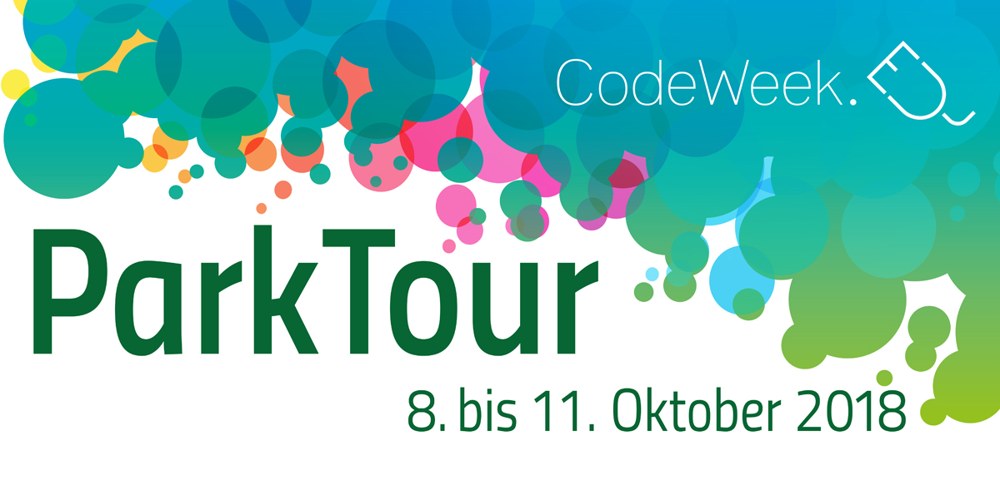
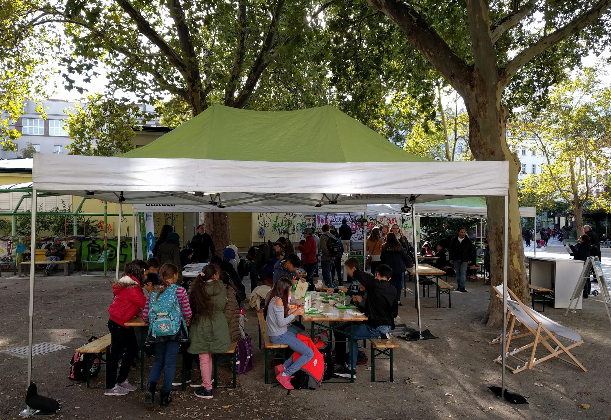

# CodeWeek ParkTour 2018

Gratis Workshops in Wien Parks!

Bei der ParkTour geht es darum Kindern und Jugendlichen einen niederschwelligen Zugang zu den Themen Programmierung, Robotik und Digitalisierung zu ermöglichen.

## Programmieren in Wiener Parks!
 
Zusammen mit diversen österreichischen Initiativen bietet CodeWeek.at in der Woche vom **8. Oktober 2018** in Wiener Parks gratis Workshops rund um Programmierung, Robotik und Digitalisierung an. Das Ziel: Kinder und Jugendliche zwischen 7 und 17 für das Thema Coding zu begeistern.

Elektronische Medien haben als Kommunikationstools als auch Unterhaltungsinstrumente viel zu bieten. Darüberhinaus können Sie aber gerade Kinder und Jugendliche auf spannende und interessante Weise vielfältig fordern und zum analytischen Denken anregen. Im Rahmen der ParkTour haben wir eine Reihe von Angeboten ausgesucht, die visuell gestalterisch oder aktiv agierend – mit oder ohne Computer – Kinder und Jugendliche mit diesen Prozessen vertraut machen sollen. Das Verstehen von informationstechnologischen Abläufen ist gegenwärtig wie zukünftig eine Kernkompetenz bei der  logisches Denken genauso gefragt ist, wie empathisches Agieren im Zusammenhang mit dem Wirken in sozialen Medien.

Als Team der Codeweek-Österreich und des Vereins OLPC Austria haben wir uns die ParkTour ausgedacht und werden nach 2017 heuer zum zweiten Mal in einer Art Open-Air Veranstaltung einzelne Wiener Parks und Plätze besuchen um unsere Zelte dort aufzuschlagen. Als Partner haben wir die MA13 – Fachbereich Jugend, die die Vernetzung zu lokalen Jugendorgansiationen übernommen hat, logistisch – in der Event-Abwicklung, sowie Aufbau und Vernetzung – unterstützt uns das Team der A1 Telekom Austria.

## Wann und Wo

* Montag, 8.10. 14-17 Uhr: Resselpark/Karlsplatz (1040 Wien) ([Karte](https://www.wien.gv.at/stadtplan/grafik.aspx?lang=de-AT&bookmark=VN5nRq0VHEbphFVE5NCvQ-a5Rphlnqnnkur2pH4Oprw-b-b&bmadr=10002326)) mit Stationen von:
  * A1 “Internet für Alle”
  * Bildungsserver Wien
  * CoderDojo
  * Robo Wunderkind
  * Wunderwuzzi
* Dienstag, 9.10. 14-17 Uhr: Steinbauerpark (1120 Wien) ([Karte](https://www.wien.gv.at/stadtplan/grafik.aspx?lang=de-AT&bookmark=2PpHRtto-a0XphNVD5NAvQ-a5Rphlnqnnkur2pH4Oprw-b-b&bmadr=10010290)) mit Stationen von:
  * A1 “Internet für Alle”
  * Bildungsserver Wien
  * CoderDojo
  * OEG3D
  * Wunderwuzzi
* Mittwoch, 10.10. 14-17 Uhr: Kardinal-Nagl Platz (1030 Wien) ([Karte](https://www.wien.gv.at/stadtplan/grafik.aspx?lang=de-AT&bookmark=cb2HRv1nGUbphNVD5NAvQ-a5Rphlnqnnkur2pH4Oprw-b-b&bmadr=10002296)) mit Stationen von:
  * A1 “Internet für Alle”
  * Bildungsserver Wien
  * CoderDojo
  * Spielend Programmieren
  * Wunderwuzzi
* Donnerstag, 11.10. 14-17 Uhr: Franklinstrasse (1210 Wien) ([Karte](https://www.wien.gv.at/stadtplan/grafik.aspx?lang=de-AT&bookmark=mAqHRsxme0bphFVE5NCvQ-a5Rphlnqnnkur2pH4Oprw-b-b)) mit Stationen von:
  * A1 “Internet für Alle”
  * Bildungsserver Wien
  * CoderDojo
  * TechnikBasteln
  * Wunderwuzzi

## Partner und Stationen

* [A1 “Internet für Alle”](https://a1internetfueralle.at/home/): "Wir vermitteln dir die Grundbegriffe des Codings mit einem coolen Programmierspiel - offline ohne Computer, aber mit Verkleidungen und hohem Spaßfaktor!"
* [Bildungsserver Wien](http://bildungsserver.wien): "Unsere Blue Bot-Lernroboter führen dich in die Welt des Programmierens ein. Löse knifflige Aufgaben und lerne dabei Wien besser kennen."
* [CoderDojo Wien](http://wien.coderdojo.net/): "Das CoderDojo ist ein Club für Kinder und Jugendliche zwischen 8 und 17 Jahren, in dem sie Technik und Programmieren lernen können. In regelmäßigen Treffen werden verschiedene Übungen gemacht. Wenn du zwischen 8 und 17 Jahre alt bist, komm vorbei."
* [OEG3D](https://www.oeg3d.at): "Bei uns kann man sein eigenes Schmuckstück am Computer erstellen, anschließend ausdrucken und so erleben, wie die Produktion der Zukunft aussehen kann."
* [Robo Wunderkind](https://robowunderkind.com/de/): "Mit Robo Wunderkind ist das Bauen und Kodieren von echten Robotern ein Kinderspiel. Durch eine taktile Hardware und eine intuitive Software können dadurch Kindern die Grundlagen des Kodierens und der Robotik auf einfache und spielerische Art und Weise vermittelt werden."
* [Spielend Programmieren](http://spielend-programmieren.at): "Einführung in die Computerspieleprogrammierung mit der Programmiersprache Python. Geeignet für Kinder ab 10 Jahre die bereits Erfahrung im Umgang mit der Tastatur haben. Es wird empfohlen einen eigenen USB-Stick mitzubringen, um die selbst erstellten Programme mit nach Hause nehmen zu können".
* [TechnikBasteln](http://www.technikbasteln.net/): "Wolltest du schon immer wissen wie ein Laptop von innen aussieht? Bei uns kannst du einen zerlegen und - idealerweise - danach wieder zusammenbauen."
* [Wunderwuzzi](http://www.wunderwuzzi.at/): "Bau dir deinen eigenen kleinen Wunderwuzzi Zahnbürsten Roboter, den du nach Hause mitnehmen kannst."

## Rückfragehinweis

Mag.ª Andrea Mayr-Stalder, info@codeweek.at, (Tel.: +43 699 11098878)

[back](./)
